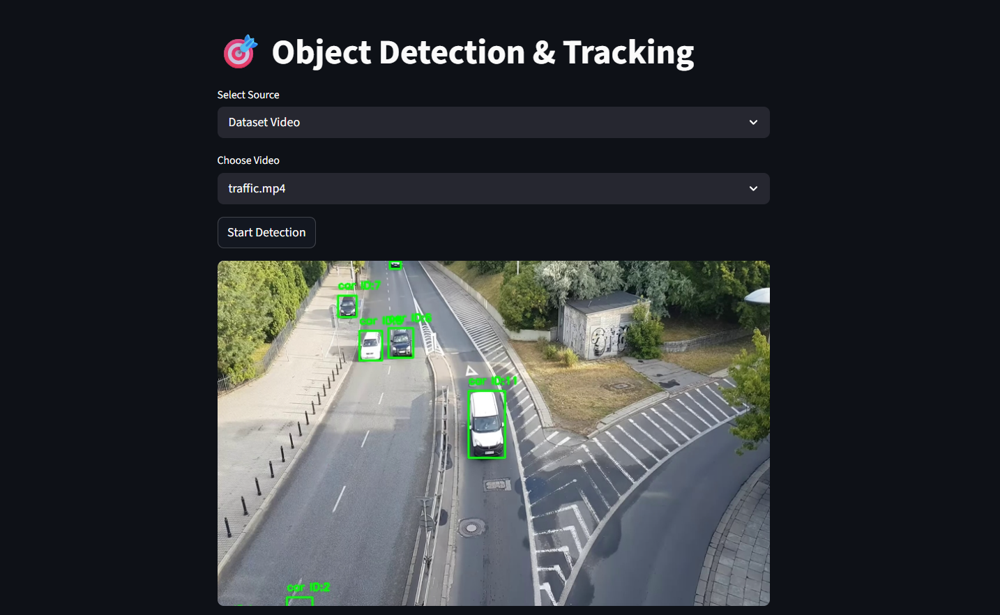
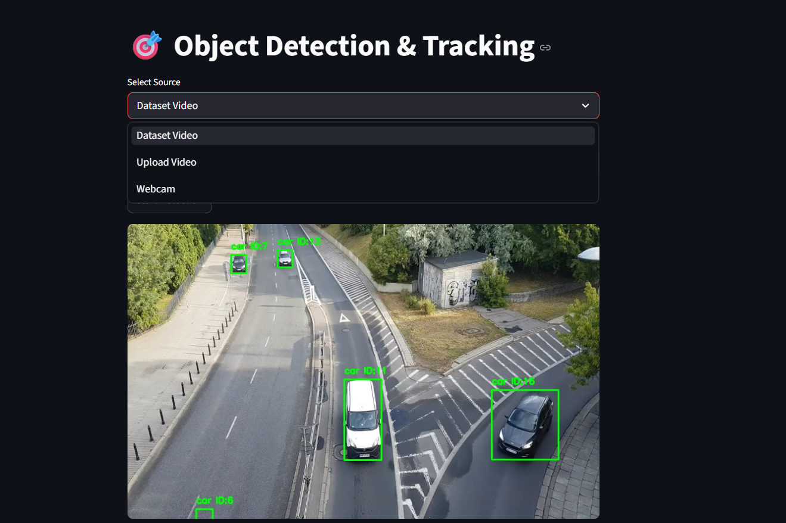

# 🎯 Object Detection and Tracking using YOLOv8 & Deep SORT

## Overview

This project performs real-time object detection and tracking using YOLOv8 and Deep SORT. Users can analyze objects from a dataset video, upload a custom video, or use a webcam for live detection.

The application is built with Streamlit and displays detected objects with bounding boxes, labels, and unique tracking IDs.

## Features

* Object detection using YOLOv8s
* Multi-object tracking using Deep SORT
* Dataset video selection
* Custom video upload
* Webcam support (local execution)
* Real-time bounding boxes and tracking IDs
* Streamlit-based user interface

## Demo

Try the app: 

## Technologies Used

* Python
* Streamlit
* OpenCV
* YOLOv8 (Ultralytics)
* Deep SORT

## Project Structure

```text
object_detection_tracking/
│
├── app.py
├── requirements.txt
├── README.md
├── .gitignore
├── yolov8s.pt
│
└── dataset/
    ├── video1.mp4
    ├── video2.mp4
    └── ...
```

## Installation

Clone the repository:

```bash
git clone <repository-url>
cd object_detection_tracking
```

Install dependencies:

```bash
pip install -r requirements.txt
```

## Run the Application

```bash
streamlit run app.py
```

## Usage

1. Launch the application.
2. Select an input source:

   * Dataset Video
   * Upload Video
   * Webcam
3. Start detection.
4. View detected objects with labels and tracking IDs.

## Output

* Bounding boxes around detected objects
* Object class labels
* Unique tracking IDs
* Real-time visualization

## Screenshots

### Home Screen


### Output Result


 
## Future Enhancements

* Object counting
* Traffic analysis
* Person re-identification
* Cloud deployment
* Analytics dashboard

## License

MIT License


## Author

amarsahu21724-max
